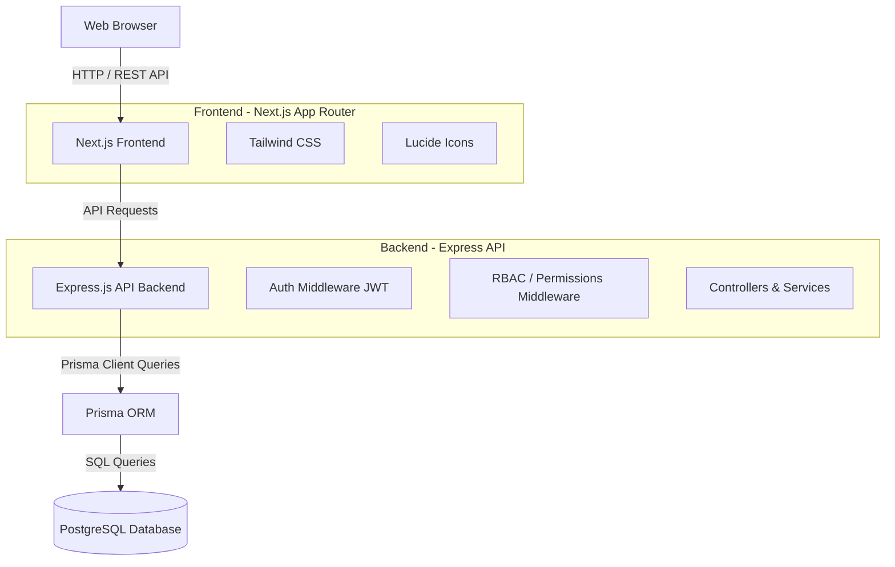
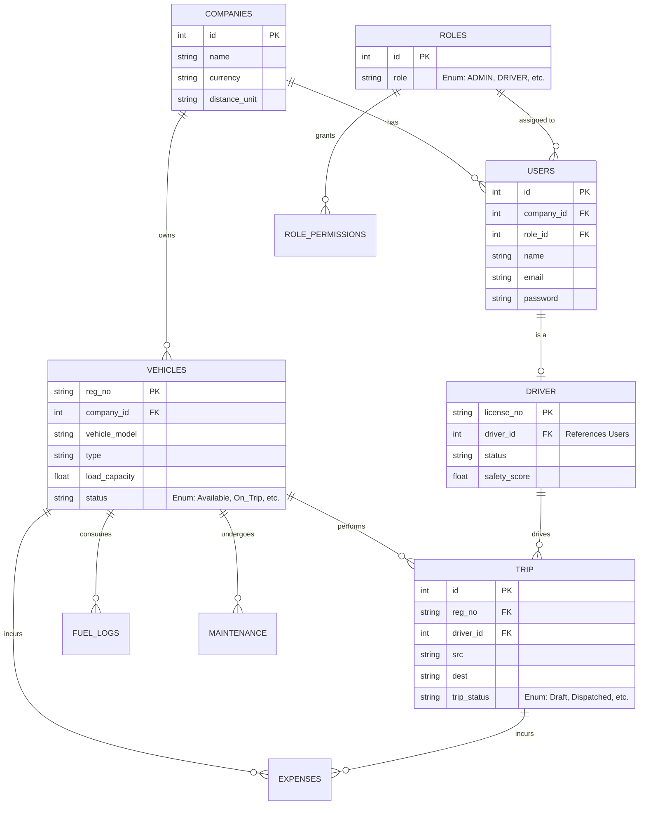

# TransitOps - Fleet Management System

TransitOps is a comprehensive, full-stack logistics and fleet management platform designed to streamline the operations of transport and logistics companies. It provides tools for managing vehicles, drivers, trips, fuel consumption, maintenance, and expenses, all within a role-based access control system.

## 🌟 Key Features

- **Fleet Management**: Track vehicle status, details, capacity, and cost.
- **Driver Management**: Monitor driver statuses, safety scores, licenses, and contact information.
- **Trip Tracking**: Create, dispatch, and track trips from source to destination with real-time status updates.
- **Fuel & Expense Tracking**: Log fuel consumption and trip-related expenses (maintenance, toll, others) to calculate operating costs.
- **Maintenance Records**: Schedule and track vehicle maintenance (routine, oil changes, brake service, etc.).
- **Role-Based Access Control (RBAC)**: Secure access with distinct roles (`ADMIN`, `DRIVER`, `FLEET_MANAGER`, `DISPATCHER`, `SAFETY_OFFICER`, `FINANCIAL_ANALYST`) and granular permissions.
- **Company Multi-tenancy**: Designed to support organizational structures and company-specific configurations.

---

## 🏗 System Architecture

The application is built on a modern stack featuring a Next.js frontend and an Express.js backend powered by Prisma and PostgreSQL.



---

## 🗄 Database Schema (ERD)

The relational database is carefully structured to handle complex fleet operations. 
[View the detailed Database Design Document](https://drive.google.com/file/d/1b_byAQeu0nbLQVDn76YKu6tdoJpmf7vp/view?usp=sharing)



---

## 🛠 Tech Stack

### Frontend
- **Framework**: [Next.js](https://nextjs.org/) (App Router)
- **Library**: [React 19](https://react.dev/)
- **Styling**: [Tailwind CSS v4](https://tailwindcss.com/)
- **Icons**: [Lucide React](https://lucide.dev/)

### Backend
- **Framework**: [Express.js](https://expressjs.com/)
- **Language**: TypeScript
- **ORM**: [Prisma](https://www.prisma.io/)
- **Database**: PostgreSQL
- **Security**: JWT Authentication, Custom Role & Permission Middleware

---

## 🚀 Getting Started

### Prerequisites
- Node.js (v20+)
- pnpm (recommended) or npm/yarn
- PostgreSQL Database
- Docker (optional, for running the database)

### Backend Setup
1. Navigate to the backend directory:
   ```bash
   cd backend
   ```
2. Install dependencies:
   ```bash
   pnpm install
   ```
3. Set up your `.env` file (copy from `.env.example` if available) and ensure `DATABASE_URL` is set.
4. Run Prisma migrations:
   ```bash
   pnpm dlx prisma migrate dev
   ```
5. Start the development server:
   ```bash
   pnpm dev
   ```

### Frontend Setup
1. Navigate to the frontend directory:
   ```bash
   cd frontend
   ```
2. Install dependencies:
   ```bash
   pnpm install
   ```
3. Start the Next.js development server:
   ```bash
   pnpm dev
   ```

The frontend will be available at `http://localhost:3000` and the API backend typically at `http://localhost:5000` (depending on your `.env` configuration).

---

## 🤝 Contributing
1. Fork the repository
2. Create your feature branch (`git checkout -b feature/amazing-feature`)
3. Commit your changes (`git commit -m 'Add some amazing feature'`)
4. Push to the branch (`git push origin feature/amazing-feature`)
5. Open a Pull Request
